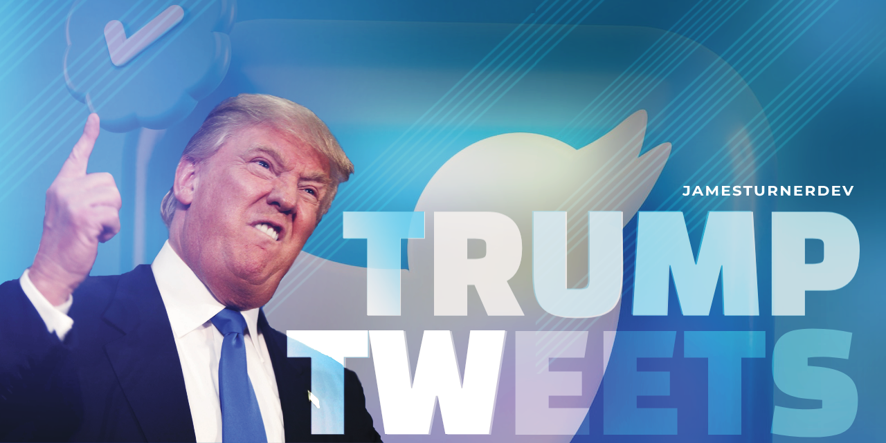

# Trump Tweets

### Thousands of Tweets about Trump in the json format

#### TL;DR
**The data you are looking for is in the data directory.**  

The json direcotry has the same info but with the full user data.  The archive / data / raw has the original weekly tweet scrapes.

###### More...

This repository contains a dump of some ( ~ 180k or so ) raw json files I compiled over the last couple weekends relating to the possible upcoming arrest of Donald Trump. 

**This is all publicly available data.  All I did was grab it :)**

For the first run each file contains between 5,000 and 1,000 tweets and is named by the querey I used to search Twitter to find the tweets.  The second run of data I did was a bit more refined and I some insights from the first run.  I weighted the number of Tweets based on how popular a query was.  For example, the query `#MAGA` was much more popular / frequent than `#CampaignFinanceLaw` so I grabbed more of tweets in the maga.json file than I compiled in the campaign-finance-law.json file.  Similarlly the queries between the two weeks are not identical as I learned which queries were more popular and which were less popular.

There is now a third run of data.  I used mostly the same queries as the previous two runs but included less of them and grabbed more data for each keyphrase.

There is some code in the utils directory that I used to do various tasks. Keep in mind that it was all single use code and I didn't bother to make it pretty or reusable.  
